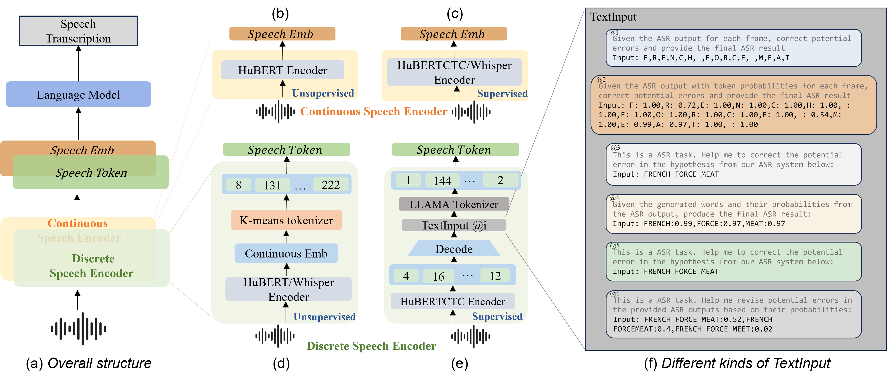
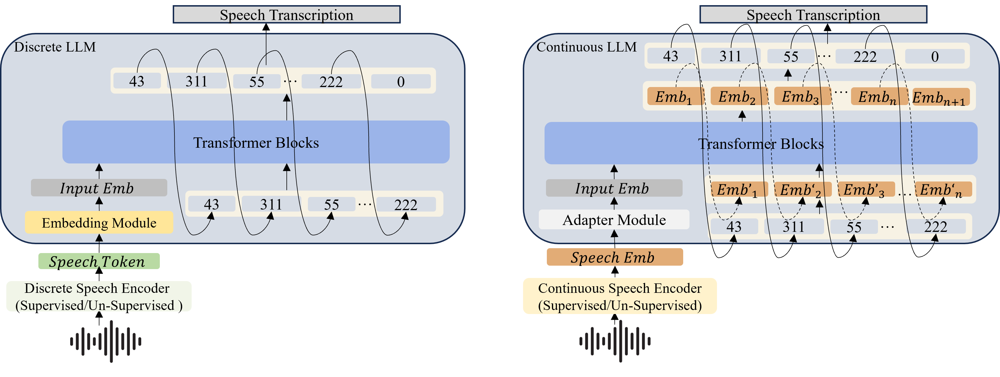
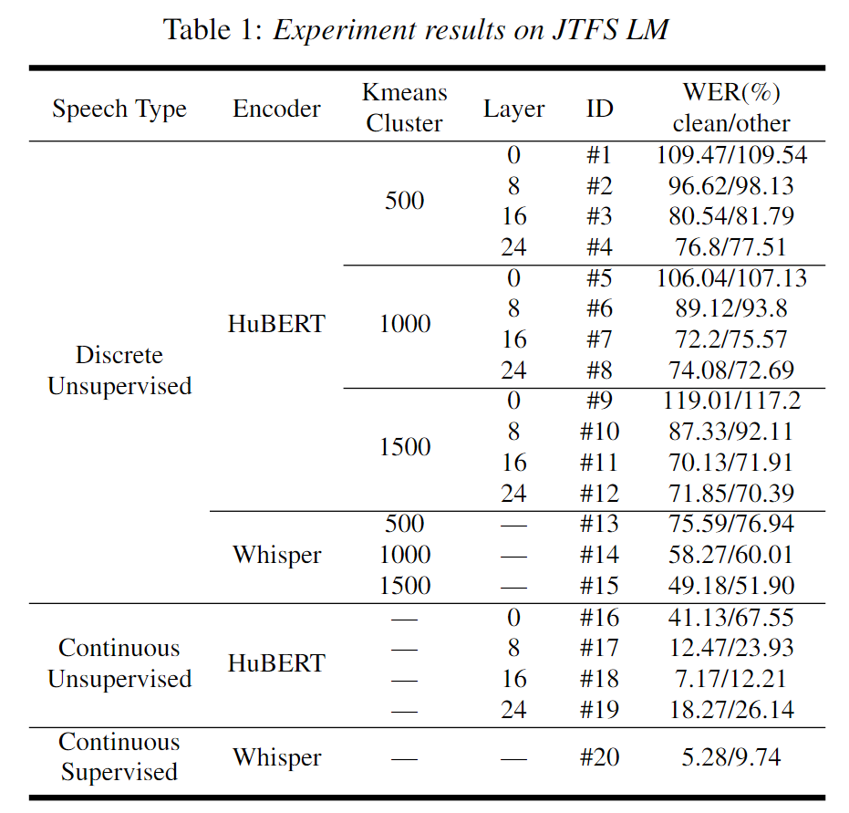
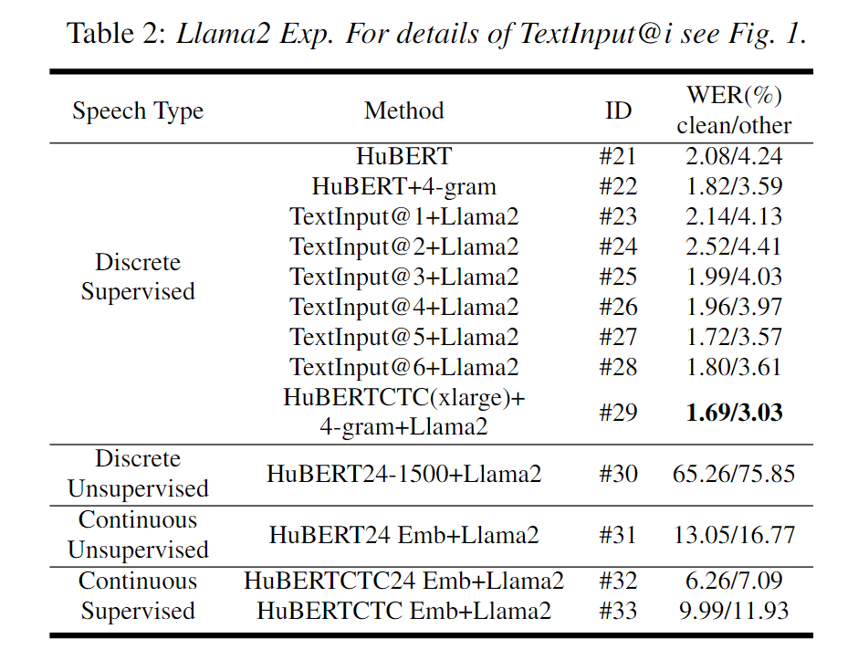

# Comparative Analysis of Discrete and Continuous Space LLMs in Speech Recognition

This repository hosts the source code associated with the research paper titled "Comparative Analysis of Discrete and Continuous Space LLMs in Speech Recognition", which has been submitted to Interspeech 2024. The paper's link remains anonymous during the review process and will be made public once the paper is accepted.



Overall architectures for continuous and discrete speech encoders. Figures (b) to (e) illustrate four distinct speech encoders, each extracting a different type of speech representation.

## Prerequisites and Installation

To ensure a smooth setup of the environment, install the necessary packages enumerated in the `requirements.txt` file with the following command:

```
pip install -r requirements.txt
```

## Repository Structure and Content

This repository comprises a `code` directory along with this `README.md` file. The `code` directory is further subdivided into five subdirectories: `dataset`, `inference`, `train`, `model`, and `module`.

### Code

#### Dataset

The `dataset` subdirectory within `code` encompasses the dataloader and examples pertinent to the supervised discrete data experiments (#21-#29) discussed in the paper. Precisely, it aligns with experiment #27 featuring TextInputs @3. The examples for the validation and two test sets are housed in the `dataset/json` subdirectory. The training dataset, owing to its substantial size, will be made available post the paper's acceptance.

#### Inference

The `inference` subdirectory within `code` comprises inference scripts for a variety of models. In a similar vein, the `train` subdirectory includes training scripts for these models.

#### Model

The `model` subdirectory within `code` encapsulates different model architectures utilized in the experiments.

#### Module

The `module` subdirectory within `code` houses the modules that the models are dependent on.


Model Design for Discrete and Continuous Cases: In right fig, dashed lines show the data flow for the JTFS LM, and solid lines for the Llama2 model.

## Future Updates

Given the extensive number of parameters in the models, it is not feasible to incorporate all the checkpoints in this repository simultaneously. Subsequent to the paper's acceptance, we plan to incrementally release the checkpoints.

## Experiment Results

The following figures represent the experimental results of our study.

### JTFS LM Results



### Llama2 Results

